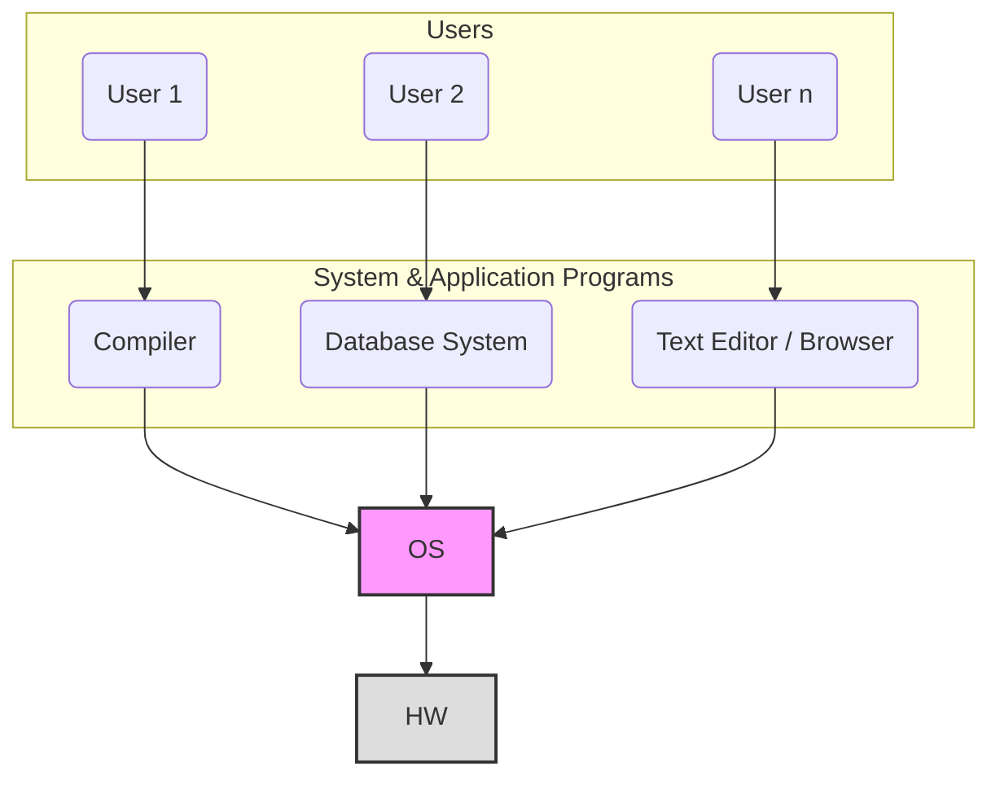
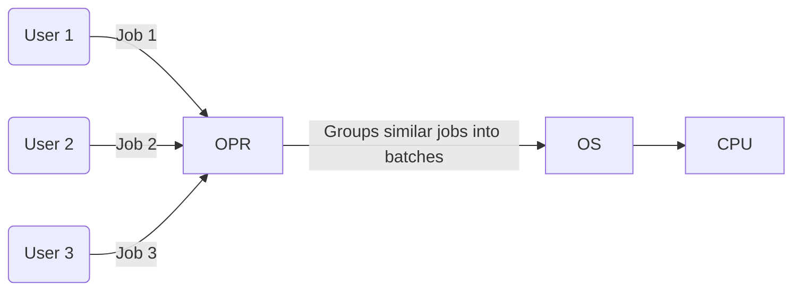
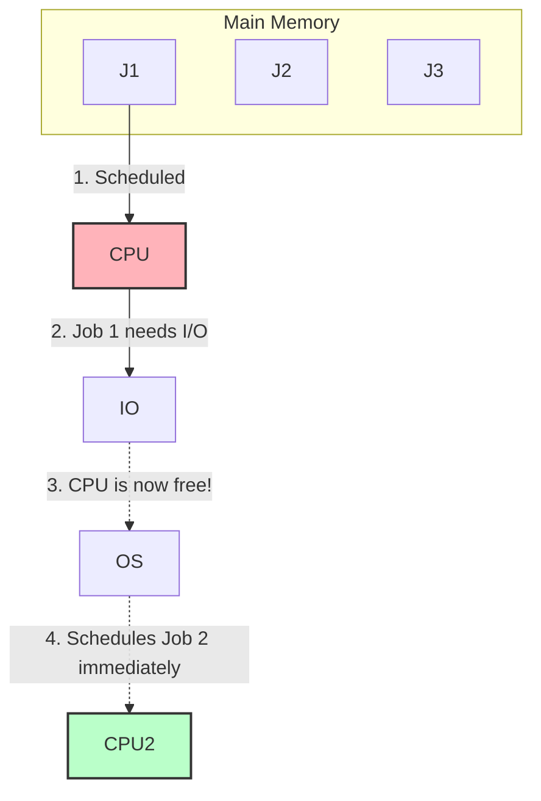
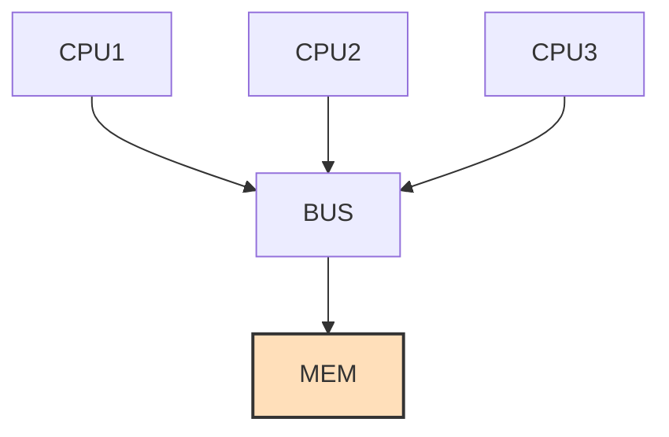

Here are the comprehensive, GATE-focused study notes based on the video lecture, synthesizing both the spoken explanations and whiteboard concepts. 

---

# Operating Systems: Introduction and Background

## 1. GATE Syllabus Breakdown & Weightage
Operating Systems generally carry a significant weightage of **8 to 10 marks** in the GATE CSE exam. The syllabus and priority areas are distributed as follows:

*   **Process Management (~40% of questions):** Process concepts, CPU Scheduling (High Priority), Synchronization (High Priority), Concurrent Programming, Deadlocks, Threads.
*   **Memory Management (~40% of questions):** Main memory organization, Paging, Multilevel Paging, Segmentation, Virtual Memory.
*   **File Systems (~20% of questions):** Disk scheduling algorithms, Disk space allocation methods.

*Recommended Textbooks:* *Operating System Concepts* by Galvin, *Modern Operating Systems* by A.S. Tanenbaum.

---

## 2. What is an Operating System?

### Formal yet Intuitive Definition
An **Operating System (OS)** is a system software that acts as an **intermediary (interface)** between the user/user applications and the underlying raw computer hardware. It hides the messy details of the hardware and provides a clean, easy-to-use environment.

### Abstract View of a Computer System
To understand the interface concept, we look at the layered architecture of a computer system. 


*(Since a direct reliable image link could not be extracted via search, a Level 2 Mermaid diagram is provided for the standard abstract view).*

### Abstraction and System Calls
**Abstraction** means hiding non-essential, complex hardware details from the programmer. 

**How does abstraction happen? Through System Calls.**
A **System Call** is a programmatic request made by a user-level program to the OS to access hardware resources. 

**Professor's Example:**
```c
void main() {
    int x;
    printf("hello");     // Wants to print to the Monitor (Hardware)
    scanf("%d", &x);     // Wants to read from the Keyboard (Hardware)
}
```
*   `printf()` is a standard C library function. Internally, it invokes the **`write()` system call** to tell the OS to illuminate specific pixels on the monitor.
*   `scanf()` internally invokes a system call (like `read()`) to interact with the keyboard.
*   *Key Takeaway:* Without the OS, you would have to write hundreds of lines of binary machine code just to print "hello" to the screen. 

### OS as a Resource Manager
The OS is essentially a manager that fairly and efficiently allocates resources to active processes. 
*   **Hardware Resources:** CPU (Processor time), Main Memory (RAM), I/O Devices.
*   **Software Resources:** Files, Directories, Locks.

---

## 3. Goals of an Operating System

1.  **Primary Goal: Convenience (Ease of Use)**
    *   The system should be exceptionally user-friendly. 
    *   *Example:* **Windows OS** is designed primarily for convenience, utilizing a heavy Graphical User Interface (GUI).
2.  **Secondary Goal: Efficiency (Resource Utilization & Stability)**
    *   The system should utilize hardware resources (CPU, Memory) to their absolute maximum potential without crashing.
    *   *Example:* **Linux/UNIX** is designed primarily for efficiency and high stability, which is why it dominates the server market.

---

## 4. Types of Operating Systems (Evolution)

### I. Batch Operating System
In a Batch OS, users do not interact directly with the computer. Instead, similar jobs are grouped into "batches" by an operator and submitted to the memory. 

*   **Execution Flow:** A job requires two types of processing time: **CPU Time** (for math/logic) and **I/O Time** (for input/output operations like reading a file). 
*   **The Flaw:** If Job 1 is executing on the CPU and requires an I/O operation, it moves to the I/O devices. However, the OS **does not** schedule Job 2. The CPU sits entirely idle until Job 1 finishes its I/O and entirely completes its execution.
*   **Drawbacks:** 
    1.  **High CPU Idleness:** Poor resource utilization.
    2.  **Decreased Throughput.**



> **GATE Concept: Throughput**
> Throughput is the number of jobs completed per unit of time.
> $$Throughput = \frac{\text{Number of Jobs Completed}}{\text{Unit of Time}}$$

### II. Multiprogramming Operating System
Multiprogramming was introduced to solve the severe CPU idleness problem found in Batch Systems.
*   **Concept:** Multiple jobs are loaded into Main Memory simultaneously. The number of jobs in memory is called the **Degree of Multiprogramming**.
*   **Execution Flow:** If Job 1 is running on the CPU and requests an I/O operation, it leaves the CPU. **Immediately**, the OS Scheduler picks Job 2 from memory and assigns it to the CPU.
*   **Advantages:**
    1.  **High CPU Utilization:** The CPU is rarely idle.
    2.  **Increased Throughput.**



### III. Multitasking Operating System (Time-Sharing)
Multitasking is a logical extension of Multiprogramming.
*   **Concept:** Jobs share the CPU based on a strictly enforced **Time Quantum (Time Slice)**. 
*   **Professor's Example:** Assume a time slice of `2ns`. Job 1 runs for 2ns and gets preempted (paused). Job 2 runs for 2ns and gets preempted. Job 3 runs for 2ns, and so on in a Round-Robin fashion.
*   **The Magic:** Because the switching is so unimaginably fast ($1 ns = 10^{-9} seconds$), the human user gets the **illusion** that multiple programs (e.g., watching a Movie, downloading a Game, having a Browser open) are running exactly at the same time in parallel.
*   *Examples:* Windows, Linux, macOS.

### IV. Multiprocessor Operating System (Parallel System)
Unlike previous systems which used a single CPU, a Multiprocessor system physically contains **more than one CPU** sharing a common computer bus, clock, and memory.



**Advantages:**
1.  **Increased Throughput:** True parallel execution of tasks.
2.  **Reliability & Fault Tolerance:** Graceful degradation. If CPU 1 fails, the system does not crash; it simply continues to operate using CPU 2 and CPU 3, albeit slightly slower. 
3.  **Economical:** Buying one integrated system with 3 CPUs (sharing one motherboard, power supply, and memory) is significantly cheaper than buying 3 completely separate, standalone computers.

*Real-World Application:* Massive database servers (like IRCTC or Banking servers) utilize Multiprocessor systems because they require extremely high fault tolerance and cannot afford system downtime.
