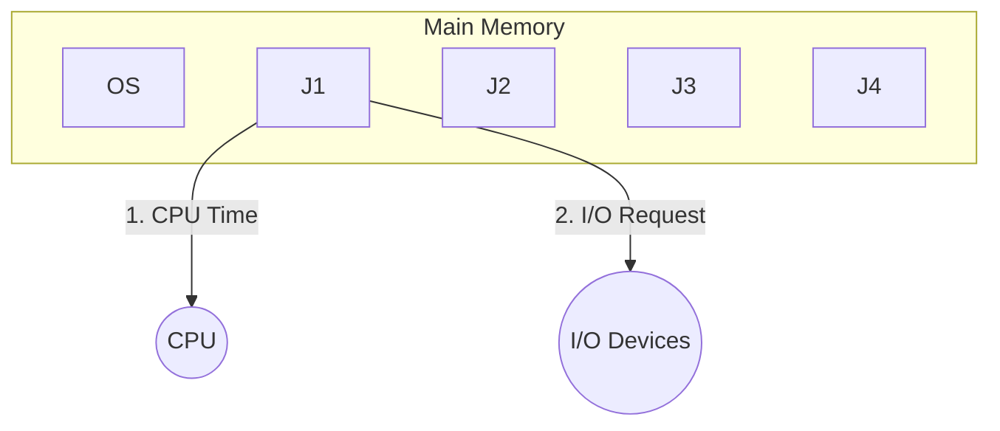
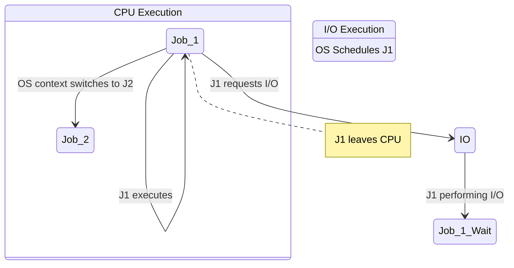
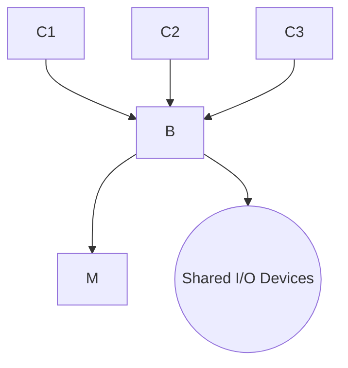

Here are the comprehensive, highly structured study notes derived from the lecture, curated specifically for GATE CSE preparation.

---

# Operating Systems: Introduction, Background, and Evolution

## 1. GATE Syllabus & Weightage Analysis
Based on previous year GATE CSE trends, the Operating System (OS) module yields an average of **8 to 10 marks**. The syllabus is divided into four major pillars:

1.  **Process Management (~40% Weightage):** Process Concept, CPU Scheduling, Synchronization, Deadlocks, Threads. *(High Yield: Synchronization & CPU Scheduling)*
2.  **Memory Management (~40% Weightage):** RAM implementation, Loading/Linking, Memory Management Techniques (Paging, Segmentation), Virtual Memory.
3.  **File Systems (~20% Weightage):** Disk scheduling, space allocation methods.
4.  **Introduction & Background:** Foundational concepts (covered in these notes).

**Recommended Textbooks:**
*   *Operating System Concepts* by Silberschatz, Galvin, and Gagne.
*   *Modern Operating Systems* by A.S. Tanenbaum.

---

## 2. Core Concept: What is an Operating System?

While colloquially defined as a "mediator" or "interface," the rigorous definition of an Operating System is critical for theoretical clarity.

**Standard Definition:** An Operating System is system software that acts as an intermediary between the computer hardware and the computer user. It provides an abstraction layer to hide hardware complexity and an environment in which user programs can execute conveniently and efficiently.

### 2.1 The Concept of System Calls
User applications cannot directly access computer hardware (like the monitor or keyboard). They must request access via the OS using **System Calls**.

**Professor's Example:**
Consider a basic C program:
```c
#include <stdio.h>
void main() {
    int x;
    printf("Hello");
    scanf("%d", &x);
}
```
**Step-by-Step Execution Analysis:**
1.  `printf("Hello");` interacts with the **Monitor** (Output Hardware).
2.  `scanf("%d", &x);` interacts with the **Keyboard** (Input Hardware).
3.  The standard C library function `printf()` does not natively know how to manipulate monitor pixels. Instead, it internally invokes a **`write()` System Call**.
4.  The system call transitions the system from *User Mode* to *Kernel Mode*, allowing the OS to communicate securely with the device driver to execute the instruction.

*Formal Definition:* A **System Call** is the programmatic method by which a computer program requests a service from the kernel of the operating system it is executed on.

### 2.2 Operating System as a Resource Manager
The OS is responsible for fairly allocating system resources to competing processes. Resources are categorized into two types:
*   **Hardware Resources:** CPU time, Main Memory (RAM), I/O Devices.
*   **Software Resources:** Files, Directories, Semaphores, Mutexes.

---

## 3. Goals of an Operating System

Operating systems are designed with two primary competing goals depending on their intended use case:

1.  **Primary Goal - Convenience (Ease of Use):** The OS should be user-friendly. Example: *Windows OS* is highly GUI-driven, making it accessible for average users, though it sacrifices some internal efficiency.
2.  **Secondary Goal - Efficiency & Stability:** The OS must ensure resources are utilized to their maximum capacity without crashing. Example: *Unix/Linux* command-line interfaces are less "convenient" for laymen but offer superior efficiency, stability, and control, making them ideal for high-load servers.

---

## 4. Evolution and Types of Operating Systems

The lecture categorizes the evolution of operating systems based on how they handle CPU execution and I/O operations.

To understand OS efficiency, we first define a core mathematical metric:
**Throughput:** The number of processes completed per unit of time.
$$Throughput = \frac{\text{Number of jobs completed}}{\text{Unit time}}$$

*Note: Execution of any job generally consists of two phases: **CPU Time** (performing calculations) and **I/O Time** (reading/writing data).*

### 4.1. Batch Operating System
In a Batch OS, jobs with similar requirements are grouped into "batches."



**Operational Flaw:** If `Job 1` is executing on the CPU and suddenly requires an I/O operation (e.g., reading a file), it leaves the CPU and goes to the I/O device.
*   *The Catch:* In a strict Batch OS, the OS **does not** load `Job 2` into the CPU while `Job 1` is doing I/O. The CPU sits idle until `Job 1` completes its I/O and entirely finishes its lifecycle.
*   **Drawbacks:**
    1.  Increased CPU Idleness.
    2.  Severely decreased throughput.

### 4.2. Multiprogramming Operating System
Multiprogramming was introduced specifically to eliminate CPU idleness.

**Mechanism:** Multiple jobs are kept in Main Memory. If the actively running job (`Job 1`) leaves the CPU to perform an I/O operation, the OS immediately schedules another ready job (`Job 2`) onto the CPU.



*   **Rule of Multiprogramming:** At no point should the CPU remain idle as long as there are jobs waiting in memory ready to execute.
*   **Advantages:**
    1.  Maximized CPU utilization.
    2.  Increased Throughput.

### 4.3. Multitasking (Time-Sharing) Operating System
Multitasking is a logical extension of Multiprogramming. While multiprogramming switches jobs only when a job *voluntarily* requests I/O, Multitasking forces jobs to share the CPU based on a strict **Time Quantum**.

**Mechanism:** The CPU executes multiple jobs by rapidly switching among them in a Round-Robin fashion.
*   *Professor's Example:* If the time slice is $2 ns$ ($2 \times 10^{-9}$ seconds), `Job 1` gets $2ns$, then is forcefully preempted. `Job 2` gets $2ns$, then `Job 3`, etc.
*   *Outcome:* Because the context switch happens at nanosecond speeds, the human user feels the illusion that all tasks (e.g., playing a movie, downloading a file, typing code) are happening simultaneously (Concurrency).
*   **Examples:** Windows, Linux, Unix.

### 4.4. Multiprocessor (Parallel) Operating System
Instead of sharing one CPU among multiple processes, Multiprocessor systems have **more than one CPU** sharing the same physical system bus, clock, and Main Memory.



**Key Advantages:**
1.  **Increased Throughput:** Multiple processes can genuinely run in parallel at the exact same time.
2.  **Reliability / Fault Tolerance:** If `CPU 1` fails, the system does not halt. `CPU 2` and `CPU 3` take over the workload. The system gracefully degrades rather than crashing.
3.  **Economical:** Buying one motherboard with one shared memory block and three CPUs is cheaper and takes up less physical space than buying three entirely separate, standalone computers.
