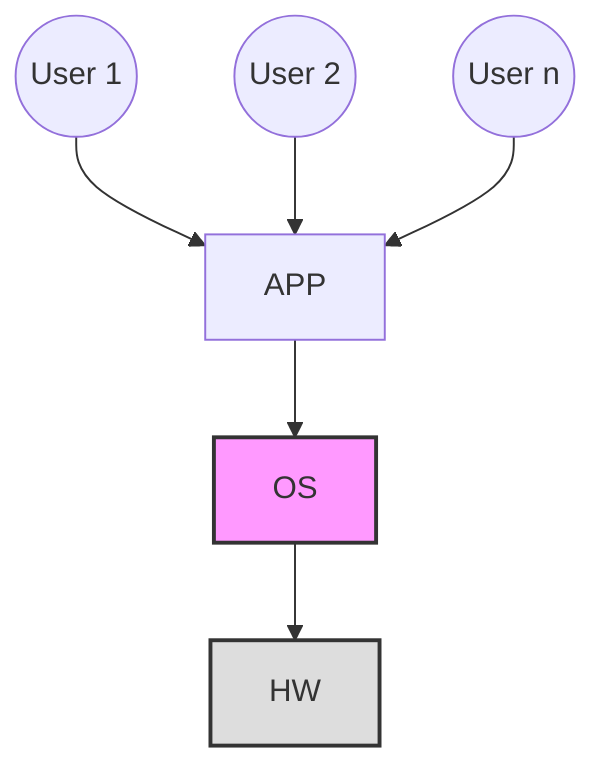
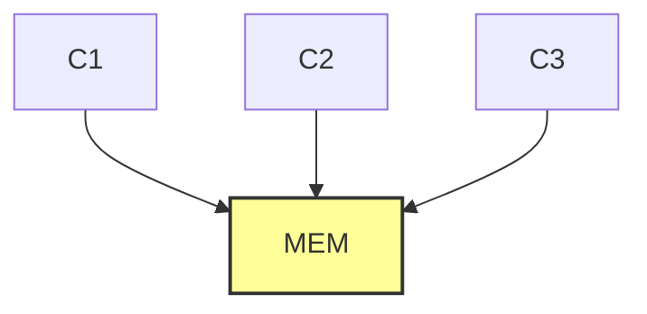

Here are the comprehensive study notes based on the video lecture, tailored specifically for GATE CSE preparation.

# Operating Systems: Introduction and Background

## 1. GATE Syllabus Breakdown & Weightage
Operating Systems generally carry an average weightage of **8 to 10 marks** in the GATE CSE exam. The syllabus can be strategically divided as follows:

*   **Process Management (~40% of questions):** Process concepts, CPU Scheduling (highly important), Synchronization (highly important), Concurrent Programming, Deadlocks, Threads.
*   **Memory Management (~40% of questions):** Main memory organization, Paging, Multilevel Paging, Segmentation, Virtual Memory.
*   **File Systems (~20% of questions):** Disk scheduling, Disk space allocation methods.

*Recommended Textbooks for Reference:* Operating System Concepts by Galvin, Modern OS by A.S. Tanenbaum.

---

## 2. What is an Operating System?

### Formal Definition
An Operating System is a system software that acts as an **interface** between the user/user applications and the underlying computer hardware.

### Abstract View of a Computer System
To understand the interface concept, we look at the layers of a computer system. The OS hides the complex details of the hardware from the user.



### Abstraction and System Calls
**Abstraction** means hiding non-essential details from the user. When a programmer writes a code, they do not need to know how the monitor's pixels are illuminated. 

**How does abstraction happen? Through System Calls.**
A **System Call** is a programmatic request made by a user-level program to the Operating System to access hardware resources or get a specific service.

**Example exactly as discussed:**
```c
void main() {
    int x;
    printf("hello");     // Wants to print to the Monitor (Hardware)
    scanf("%d", &x);     // Wants to read from the Keyboard (Hardware)
}
```
*   `printf()` is a standard library function. Internally, it invokes the **`write()` system call** to communicate with the monitor.
*   `scanf()` internally invokes a system call to communicate with the keyboard.
*   *Without the OS, the user program would have to write hundreds of lines of complex binary code just to interact with the hardware.*

### OS as a Resource Manager (Allocator)
The OS is responsible for fairly and efficiently allocating resources to active processes. 
*   **Hardware Resources:** CPU (Processor), Main Memory, I/O Devices.
*   **Software Resources:** Files, Directories.

---

## 3. Goals of an Operating System

1.  **Primary Goal: Convenience (Ease of Use)**
    *   The system should be user-friendly. 
    *   *Example:* Windows OS is designed primarily for convenience (GUI-heavy).
2.  **Secondary Goal: Efficiency (Resource Utilization/Stability)**
    *   The system should utilize hardware resources (CPU, Memory) to their maximum potential without crashing.
    *   *Example:* Linux/UNIX is designed primarily for efficiency and stability (used heavily in servers).

---

## 4. Types of Operating Systems (Evolution)

### I. Batch Operating System
In a Batch OS, similar jobs are grouped into "batches" and submitted to the memory. 
*   **Execution Flow:** A job requires two times: **CPU Time** (for processing) and **I/O Time** (for input/output operations like reading a file). 
*   **The Flaw:** If Job 1 is on the CPU and requires an I/O operation, it leaves the CPU to go to the I/O devices. However, the OS **does not** schedule Job 2 onto the CPU until Job 1 has *completely* finished all its CPU and I/O tasks.
*   **Drawbacks:** 
    1.  **High CPU Idleness:** The CPU sits idle while the job is performing I/O.
    2.  **Decreased Throughput.**

*Example:* IBM OS/2.

> **GATE Concept: Throughput**
> Throughput is defined as the number of jobs completed per unit of time (e.g., per second).
> $$Throughput = \frac{\text{Number of Jobs Completed}}{\text{Unit Time}}$$

### II. Multiprogramming Operating System
Multiprogramming was introduced to solve the CPU idleness problem of Batch Systems.
*   **Concept:** Multiple jobs are loaded into Main Memory simultaneously (Degree of Multiprogramming).
*   **Execution Flow:** If Job 1 is executing on the CPU and requests an I/O operation, it moves to the I/O devices. **Immediately**, the OS schedules Job 2 onto the CPU.
*   **Advantages:**
    1.  **Increased CPU Utilization:** The CPU is rarely idle.
    2.  **Increased Throughput.**

```mermaid
stateDiagram-v2 --> Memory: Load J1, J2, J3
    Memory --> CPU: J1 Scheduled
    CPU --> I_O_Devices: J1 requests I/O
    Note right of CPU: CPU is now free.
    Memory --> CPU: OS schedules J2 immediately
    I_O_Devices --> Memory: J1 finishes I/O
```

### III. Multitasking Operating System (Time-Sharing)
Multitasking is a logical extension of Multiprogramming.
*   **Concept:** Jobs share the CPU based on a **Time Quantum** (Time-Sharing Mode).
*   **Execution Flow (Professor's Example):** Assume a time slice of `2ns`. Job 1 runs for 2ns, gets preempted back to memory. Job 2 runs for 2ns, gets preempted. Job 3 runs for 2ns, etc. 
*   **Advantage:** Because the switching (e.g., 2ns) is so unimaginably fast ($1 ns = 10^{-9} seconds$), the user gets the **illusion** that all programs (Movie, Game, Browser) are running exactly at the same time in parallel.
*   *Examples:* Windows, Linux, UNIX, macOS.

### IV. Multiprocessor Operating System (Parallel System)
Unlike the previous systems which had a single CPU, a Multiprocessor system physically contains **more than one CPU** sharing a common computer bus, clock, and memory.



**Advantages:**
1.  **Increased Throughput:** Multiple CPUs mean true parallel execution of jobs.
2.  **Reliability (Fault Tolerance):** If CPU 1 fails, the system does not crash. It will continue to operate using CPU 2 and CPU 3 (graceful degradation). Fault tolerance means the system accepts the fault and continues running.
3.  **Economical:** Buying one system with 3 CPUs (sharing one motherboard, power supply, and memory) is cheaper than buying 3 completely separate computers.

*Real-World Use Case:* Massive database servers (like banking/IRCTC servers) use Multiprocessor UNIX systems because they cannot afford downtime (they require high fault tolerance).
